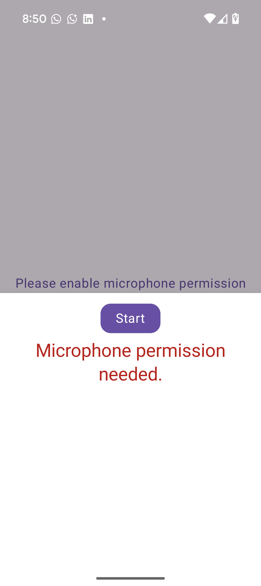

# VocalInk

VocalInk is a modern Android app that converts voice into text and stores it locally.  
Designed with Jetpack Compose, Kotlin Flow, Clean Architecture, and Hilt, the app is modular, testable, and easy to maintain.

---

## Features

- Real-time voice-to-text transcription using Android's SpeechRecognizer
- Countdown timer during voice input (default: 7 seconds)
- Offline data storage using Room database
- Timestamps displayed in a human-readable format
- Built with Jetpack Compose for declarative UI
- Lifecycle-aware state management with Kotlin Flow
- Fully functional without an internet connection

> The current recording limit is 7 seconds but can be extended if needed.  
> Transcribed voice entries are stored locally and shown in a dedicated history screen.

---

## How It Works

1. On launch, the app requests microphone permission.
2. Tap the voice input button to begin recording.
3. Speak during the countdown.
4. Your voice is transcribed and saved locally.
5. Access and view all past recordings in the history screen.

---

## Tech Stack

| Layer             | Technologies                         |
|------------------|--------------------------------------|
| UI               | Jetpack Compose, Material 3          |
| State Management | Kotlin Flow, StateFlow, ViewModel    |
| DI               | Hilt                                 |
| Data             | Room DB, Repository Pattern, UseCases|
| Speech API       | Android SpeechRecognizer             |
| Lifecycle        | repeatOnLifecycle, collectAsStateWithLifecycle |

---

## Architecture

The app follows **Clean Architecture** principles:
This structure ensures a clear separation of concerns and improves scalability and testability.

---

## Modules

| Module                 | Responsibility                                  |
|------------------------|--------------------------------------------------|
| `app`                  | App entry point and navigation                  |
| `feature/voicetotext`  | Voice input and transcription logic             |
| `feature/voicehistory` | Display of saved voice entries                  |
| `data/voice`           | Voice storage via Room                          |
| `data/timer`           | Countdown timer logic                           |
| `domain/voice`         | Use cases and domain models                     |
| `core/ui`              | Reusable UI components                         |
| `core/utils`           | Utility functions and formatting                |

---

## Testing

- Unit tests are provided for the ViewModel layer.
- The entire architecture is designed to be test-friendly, with clear separation of UI, domain, and data logic.

---

## Screenshots

  
  
  
  
  
  
  
  

