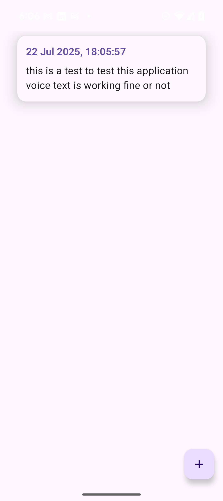
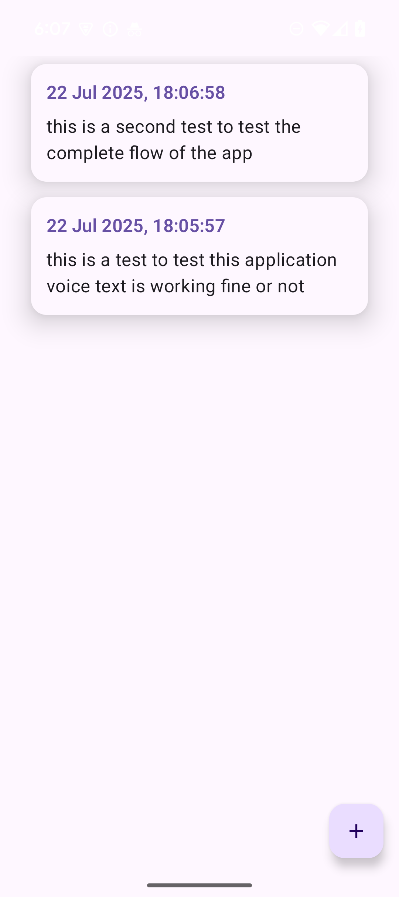
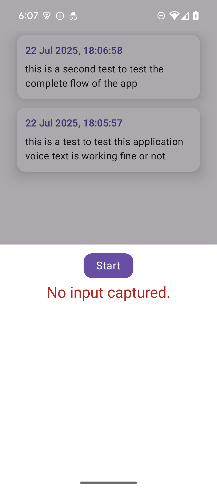

# VocalInk

VocalInk is a modern Android app that converts voice into text and stores it locally.  
It is built using Jetpack Compose, Kotlin Flow, Clean Architecture, and Hilt, making it modular, maintainable, and easy to extend.

---

## How to Use the App

- On launch, the app requests microphone permission.
- Grant the permission to enable voice recording.
- Tap the floating mic button to open the voice input screen.
- Speak while the countdown timer runs.
- Your voice will be transcribed and saved to the history screen.
- View and manage all saved voice notes from the history screen. Everything works offline.

> Note: Microphone permission is required to use the voice recording feature. If denied, the app will display a message prompting you to enable it.

---
## Screenshots

  
  
  
  
  
  

---

## Features

- Real-time voice-to-text transcription
- Countdown timer during recording
- Voice history with timestamps
- Offline support using Room database
- Modular and testable codebase
- Hilt-based dependency injection
- Built with Jetpack Compose UI

---

## Modules Overview

| Module                   | Description                                     |
|--------------------------|-------------------------------------------------|
| `app`                    | App entry point and navigation setup            |
| `feature/voicetotext`    | Voice recording and transcription logic         |
| `feature/voicehistory`   | Screen for displaying saved voice entries       |
| `data/voice`             | Room database for storing transcriptions        |
| `data/timer`             | Countdown timer logic using Kotlin Flow         |
| `domain/voice`           | Domain models and use cases                     |
| `core/ui`                | Shared Jetpack Compose UI components            |
| `core/utils`             | Utility functions and error formatting          |

---

## Architecture

The app follows **Clean Architecture** principles, promoting separation of concerns and testability:
