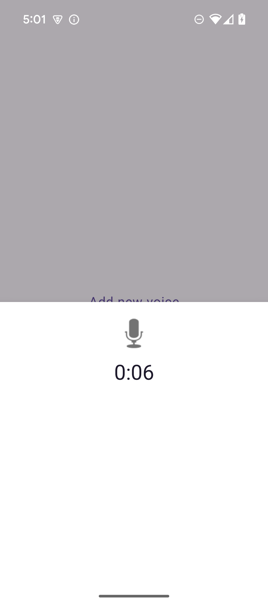

# 🎙️ VocalInk

**VocalInk** is a modern Android app that converts voice to text and stores it locally.  
Built using **Jetpack Compose**, **Kotlin Flow**, **Clean Architecture**, and **Hilt**, it is modular, testable, and developer-friendly.

---

## ✨ Features

- 🎤 Real-time voice-to-text transcription
- ⏱️ Countdown timer while recording
- 🗂️ Voice history screen with timestamps
- 💾 Offline support with Room DB
- 🧪 Modular & testable architecture
- 💉 Hilt-based dependency injection
- ⚙️ Jetpack Compose UI with preview support

---

## 📷 Preview

| Voice Input Screen | History Screen |
|--------------------|----------------|
|  |  |

> You can also record a GIF using Android Emulator or `ScreenToGif` and place it in the `screenshots/` folder.

---

## 🧩 Modules Overview

| Module                     | Description |
|---------------------------|-------------|
| `app`                     | App entry point and navigation setup |
| `feature/voicetotext`     | Voice recognition feature (record + convert) |
| `feature/voicehistory`    | Voice history listing screen |
| `data/voice`              | Local Room DB for storing transcriptions |
| `data/timer`              | Countdown timer logic using Flow |
| `domain/voice`            | Domain layer: use cases and models |
| `core/ui`                 | Shared Compose UI elements |
| `core/utils`              | Utility functions (formatting, error mapping, etc.) |

---

## 📐 Architecture

Based on **Clean Architecture** principles:

```text
View (Jetpack Compose)
↓
ViewModel (StateFlow)
↓
Use Case (Domain)
↓
Repository (Data)
↓
Data Source (Room, Manager)


### 📱 Voice Recognition Flow

**1. Home Screen**


---

**2. Start Listening Modal**


---

**3. Listening with Timer**



---

**4. First Voice Saved**


---

**5. Second Voice Saved**


---
**5. on error


